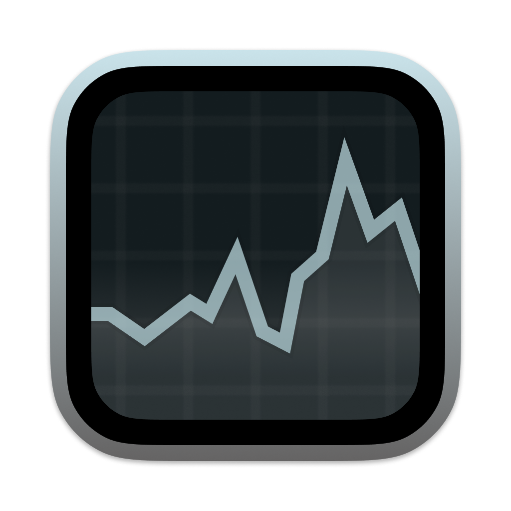
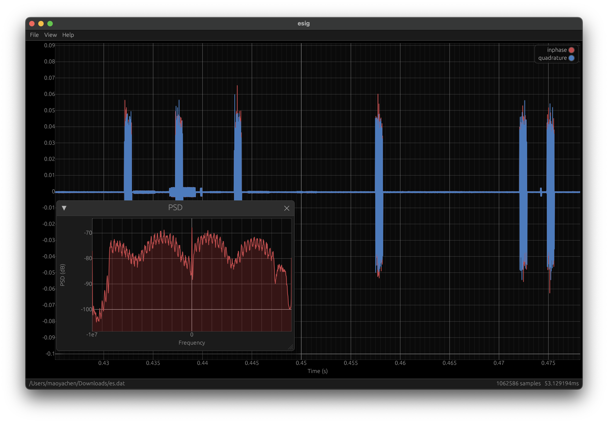

<p align="center"></p>

<p align="center">
    
    
    
</p>

# ESig

A fast signal display tool written in rust and egui, which automatically downsamples and can open large signal files (>200MB).



## Shortcuts

- `Ctrl/Command + O`: Open a file
- `Space + Drag`: Pan
- `R + Drag`: Select region
- `R + Click`: Reset region
- `Ctrl/Command + Mouse Wheel`: Zoom x-axis
- `Ctrl/Command + Z + Mouse Wheel`: Zoom y-axis
- `Ctrl/Command + P`: Open PSD window
- `Ctrl/Command + R`: Reset view

## Install on Linux

Download the latest release from the [release page](https://github.com/clysto/esig/releases) and run the following commands:

```sh
# install esig to /usr/local
sudo bash ./ESig.run
```
